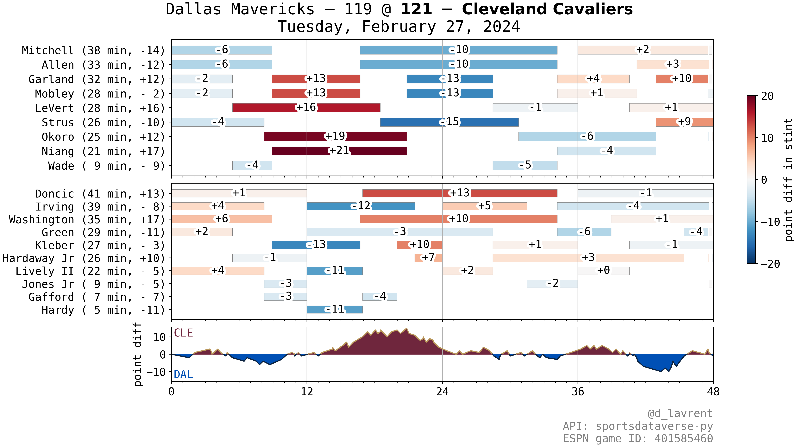

+++
title = "Starting the Site"
date = 2024-04-06
description = "First post and a little about me"

[taxonomies]
tags = ["news"]

[extra]
footnote_backlinks = true
quick_navigation_buttons = true
+++

Thanks for coming to my site! My name's Danylo, and this is the first blog I've ever written. I'm excited to see how it evolves!

### About me

By day I am a Ph.D. student doing behavioral neuroscience research with fruit flies (you can read more about my work at my personal website: [dlavrent.com](https://dlavrent.com)).

I grew up in Northeast Ohio and have been a huge Cavs fan since elementary school, when a 22-year old LeBron James lifted the team past the Detroit Pistons to make the Finals in 2007. LeBron's career has turned out to mirror major chapters in my life -- his 4 years in Miami aligning with me in high school, his second stint with the Cavs with me in college, and his move to Los Angeles with my Ph.D. Now, here we both are -- LeBron is still killing it, with 40,000+ points under his belt, and I'm still in school.

### Getting organized

Through my research and coursework, I've gotten a good deal of Python experience. Over the last few years I amassed a jumbled assortment of Jupyter notebooks analyzing and visualizing NBA data. Right before the start of the 2023-24 season, I vowed to make this as a more organized side project. I started a Twitter account and made it a goal to post regularly. In particular, after every Cavs game, I posted my version of a rotation plot showing individual player shifts, lineups used, and how the point margin evolved through the game (these kinds of plots are also available on [PopcornMachine.Net](https://popcornmachine.net/), and in the 'Plus/Minus' tab for individual games on [Basketball Reference](https://www.basketball-reference.com)):

*Example rotation plot of the [Max Strus 59-foot buzzer beater](https://www.youtube.com/watch?v=9FjvUOttXMg&ab_channel=NBA) game*

Over the past few months, it's been a blast to be able to share my work on Twitter, learn about publically-available basketball data and how people analyze it, and get better at making visualizations. I'm hoping to use this blog as a central hub for my posts and as a place for more detailed writeups.

### Why "Plot and Roll"?

Nod to the pick and roll, and I like to make plots and then roll to the next thing. Thought about Pick and Plot too, but Plot and Roll just flows better to me.