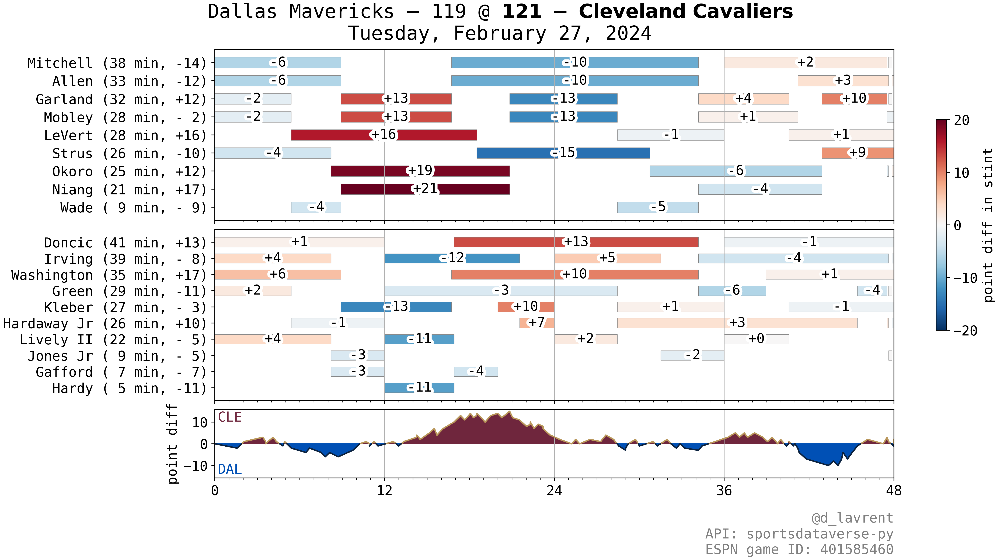

+++
title = "Interactive Game Rotation Plots"
date = 2024-04-08
description = "Web app for visualizing player shifts + lineups in any desired game this season"

[taxonomies]
tags = ["game rotations", "shiny"]

[extra]
footnote_backlinks = true
quick_navigation_buttons = true
+++

### Web app here!

Generate (and customize) a rotation plot for a game of choice in the 2023-24 season at [apps.plotandroll.com/game_rotation_app/](https://apps.plotandroll.com/game_rotation_app/)!

### Backstory

I've been [posting](https://twitter.com/d_lavrent/status/1719472374452486650) a plot like this after each Cavs game in the 2023-24 NBA season:
*Example rotation plot of the [Max Strus 59-foot buzzer beater](https://www.youtube.com/watch?v=9FjvUOttXMg&ab_channel=NBA) game*

To do this, I used the excellent [SportsDataverse](https://sportsdataverse-py.sportsdataverse.org/) Python package to pull play-by-play information from a game using an ESPN ID (the numeric code you see in an ESPN boxscore, i.e. the `401585460` in [https://www.espn.com/nba/game/_/gameId/401585460/mavericks-cavaliers](https://www.espn.com/nba/game/_/gameId/401585460/mavericks-cavaliers)).

From the play-by-play data, I parsed out substitution times for each player, and counted the game score at each substitution time to get +/-'s for each player shift. This worked pretty well, but I noted sometimes my +/- counts would occasionally be off by a point or two (I'm pretty sure I didn't manage some edge cases correctly like when players get subbed onto the floor during another player's free throws).

(I promise to release the sportsdataverse-based code to GitHub by the way, I need to reorganize some stuff!)

But also, a couple of weeks into the season, I learned about the [nba_api](https://github.com/swar/nba_api) package and was blown away by the volume of data I've always wanted access to. One of the endpoints that this API client lets you get from [nba.com/stats](nba.com/stats) is called [GameRotation](https://github.com/swar/nba_api/blob/master/docs/nba_api/stats/endpoints/gamerotation.md), and, given an game ID (an nba.com one, different from ESPN), yields the following type of information an hour or two after the game is played:



| GAME_ID  | PLAYER_FIRST | PLAYER_LAST  | IN_TIME_REAL | OUT_TIME_REAL | PT_DIFF |
|-----------|--------------|--------------|--------------|----------|---------|
| 22300832 | Kyrie        | Irving       | 0            | 4930         | 4       |
| 22300832 | Kyrie        | Irving       | 7200         | 12920        | -12     |
| 22300832 | Kyrie        | Irving       | 14400        | 18900        | 5       |



Perfect -- in/out times for each player stint, along with the point differential.

I was particularly inspired to try to make a web app after coming across this [blog post](https://blog.sradjoker.cc/posts/linux-shiny-1/) by [@SravanNBA](https://twitter.com/SravanNBA) (a great follow on Twitter!) -- the post made it much more approachable to get started with Shiny Server, and I was excited that I could keep all my code in Python.

So, in all, I swapped out my manual parsing code with the data from the much more legit nba.com using nba_api, automated the accessing and storing of the relevant game data, then I took a few weeks to learn [Shiny Server](https://shiny.posit.co/py/) for Python and wrangle with a virtual machine on Oracle Cloud (I didn't and haven't yet had to pay a dime, and again a hat tip to Sravan for mentioning this as a computing resource on [Twitter](https://x.com/SravanNBA/status/1753884937135259980)), and the result is the web app linked above.

I made a couple of stylistic changes to the plots compared to what I post on Twitter (now the away shift plot is on top of home, and I keep things in the AWAY @ HOME format as much as possible). You can choose from a couple different diverging color palettes and optionally put +/- differentials onto the shifts.

The code for the Shiny app is available on [GitHub](https://github.com/dlavrent/my_shiny_apps/tree/main/game_rotation_app). I am happy to hear feedback or answer any questions or field suggestions! You can reach me on [Twitter](https://twitter.com/plotandroll) or via [email](mailto:pnr@plotandroll.com).